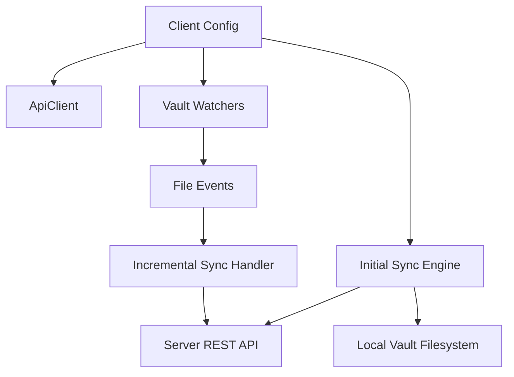
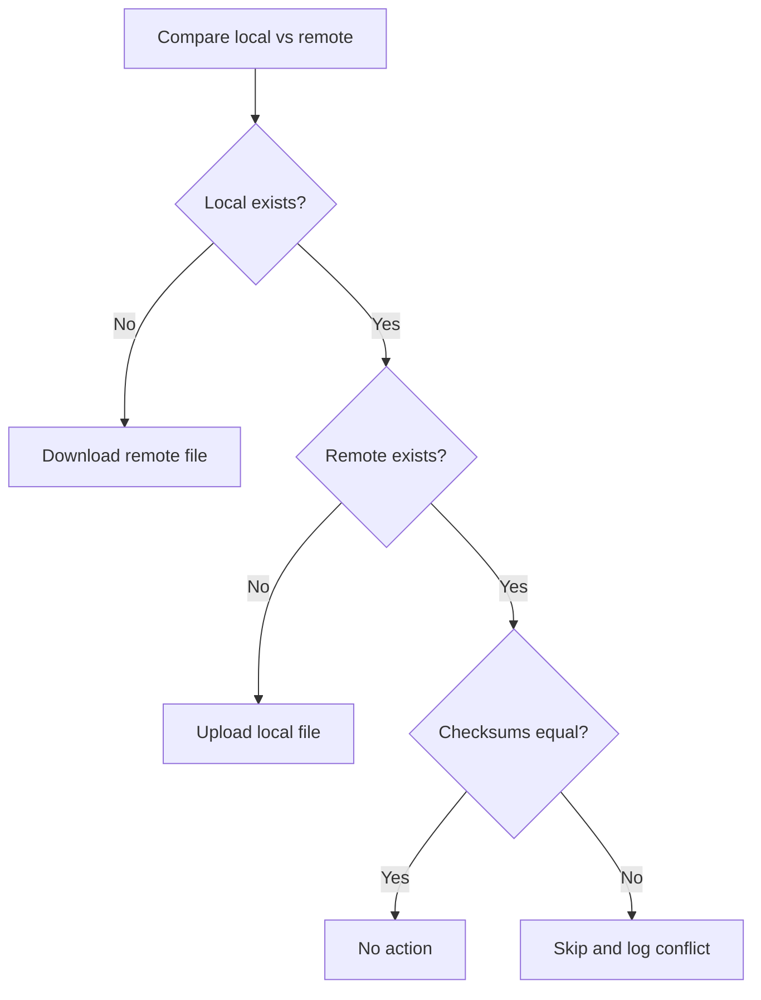

# Crate Client - Technical Documentation

This crate implements RustSync Step 3:
- client configuration loading and validation
- authenticated REST communication with the server
- initial synchronization algorithm
- filesystem watcher for incremental sync
- runtime loop orchestration

---

## Architecture Overview

The crate is split into focused modules:

- `lib.rs`: entrypoints (`run`, `run_from_default_config`) and runtime loop
- `config.rs`: config model, validation, default path, and TOML persistence
- `api.rs`: HTTP wrapper over server endpoints
- `sync.rs`: initial sync and watcher event handling
- `watcher.rs`: local filesystem event stream
- `error.rs`: unified client error type



---

## Configuration

Default config path:
- `~/.config/rustsync/config.toml` (resolved via `dirs::config_dir()`)

If missing, a sample config is created automatically by `run_from_default_config()`.

### Config model

- `server.url`: server base URL (example: `http://127.0.0.1:8080`)
- `server.api_key`: API key returned by server registration
- `vaults[]`: list of local sync roots
  - `name`
  - `local_path`
  - `remote_id` (optional, used as remote namespace prefix)
- `sync_conflict_policy`: currently `skip_and_log_conflict`

Validation rules include:
- non-empty server URL
- non-empty API key
- at least one configured vault
- non-empty vault name and namespace

---

## API Client

`api.rs` maps directly to server endpoints:

- `GET /health`
- `POST /api/clients/register`
- `GET /api/files`
- `POST /api/files`
- `GET /api/files/:id/download`
- `DELETE /api/files/:id`
- `GET /api/logs`

Auth is applied with:
- `Authorization: Bearer <api_key>`

Non-success responses are converted to:
- `ClientError::HttpStatus { status, body }`

---

## Initial Sync Strategy

The initial sync runs per vault and compares local files with remote metadata.

### Namespace mapping

Each vault maps to a remote prefix:
- `remote_id` if provided
- otherwise normalized `name`

Example:
- vault namespace: `main-vault`
- local relative path: `notes/today.md`
- remote path: `main-vault/notes/today.md`

### Rules

For each file in the vault namespace:

1. Remote exists, local missing:
- download remote content to local path

2. Local exists, remote missing:
- upload local content to server

3. Both exist, checksum differs:
- apply policy `skip_and_log_conflict`
- keep local file unchanged
- do not overwrite remote file
- emit warning log



---

## Incremental Sync (Watcher)

`watcher.rs` uses `notify` recursively on each vault root.

Event mapping:
- create/modify -> `Upsert`
- remove -> `Remove`

Handling:
- `Upsert`: read local bytes and upload to matching remote path
- `Remove`: find remote file by path and delete if found

The runtime spawns one watcher per vault and processes events through a shared Tokio channel.

---

## Public Runtime API

### `run(config: ClientConfig)`

Pipeline:
1. validate config
2. build API client
3. verify health endpoint (`status == "ok"`)
4. perform initial sync
5. start watcher tasks
6. process incremental events continuously

### `run_from_default_config()`

Behavior:
- load config from default path if present
- otherwise create sample config and save it
- call `run(config)`

---

## Error Model

Main client error categories:
- config/path errors (`InvalidConfig`, `InvalidPath`, `InvalidServerUrl`)
- network/status errors (`Http`, `HttpStatus`)
- serialization errors (`Json`, `TomlDe`, `TomlSer`)
- watcher and I/O errors (`Notify`, `Io`)
- propagated core errors (`Core`)

All messages are English-only.

---

## Testing

Current tests include:
- config persistence roundtrip
- vault namespace and remote path mapping
- path normalization helper in sync

Integration-style sync tests that require binding a local TCP socket are present but marked ignored in constrained environments.

Run:

```bash
cargo test -p client
```

Run ignored integration tests in a normal local environment:

```bash
cargo test -p client -- --ignored
```
