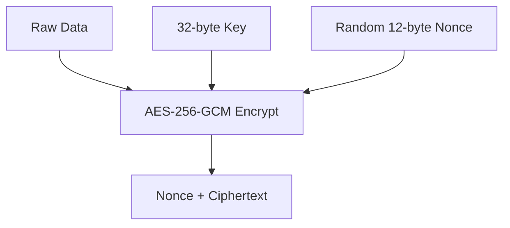
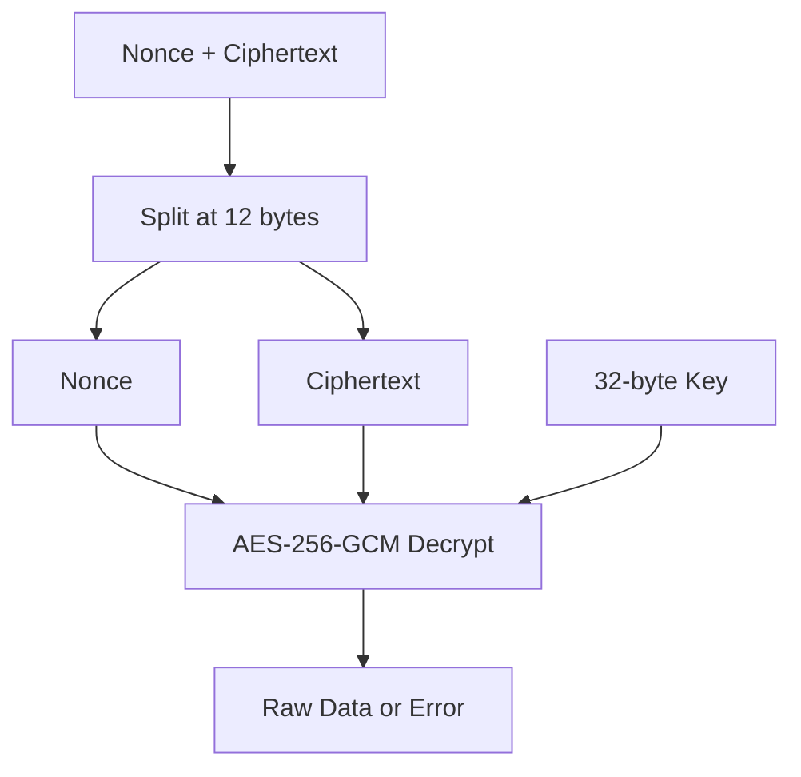
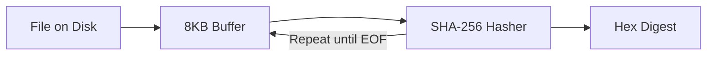

# Crate Core - Technical Documentation

This crate contains shared RustSync logic used by both server and client:
- domain data structures
- protocol message types
- cryptographic primitives
- shared error types

---

## Crate Naming and Import

The package name is `core`, but the library target is `rustsync_core`.

Why:
- keep `cargo` commands like `cargo nextest run -p core`
- avoid collisions with Rust's standard `core` crate during doctests and tooling

Use from other crates:

```toml
[dependencies]
rustsync_core = { package = "core", path = "../core" }
```

---

## Data Structures (`types.rs`)

The `types.rs` module defines shared domain models. Types implement `Serialize` and `Deserialize` for REST/JSON transport.

### 1. `FileMetadata`

Represents the synchronized state of one file:
- `id`: stable UUID
- `path`: vault-relative path
- `size`: content size in bytes
- `checksum`: SHA-256 hex checksum
- `last_modified`: UTC timestamp
- `version`: monotonic version counter

`update()` now uses `saturating_add(1)` to prevent overflow on corrupted or extreme version values.

### 2. `Client`

Represents a registered device:
- `id`: UUID identity
- `name`: display name
- `public_key`: client public key bytes
- `registered_at`: UTC timestamp

### 3. `WsMessage`

WebSocket protocol enum with tagged JSON representation (`type: snake_case`), used later by realtime conflict handling.

---

## Cryptography (`crypto.rs`)

The crate uses modern primitives for confidentiality and integrity.

### 1. Encryption/Decryption (AES-256-GCM)

`encrypt()`:
1. Generates a random 12-byte nonce
2. Encrypts plaintext with AES-256-GCM
3. Returns `nonce || ciphertext`



`decrypt()`:
1. Splits first 12 bytes as nonce
2. Uses remaining bytes as ciphertext
3. Verifies authentication tag; fails if tampered



### 2. File Integrity (SHA-256)

`calculate_checksum()` reads files as a stream (8KB chunks), which is memory-safe for large files.



Error behavior:
- missing file -> `CoreError::FileNotFound`
- other open/read I/O failures -> `CoreError::Io`

---

## Error Model (`error.rs`)

All messages are in English.

- `CoreError::Crypto(String)`
- `CoreError::Serialization(serde_json::Error)`
- `CoreError::FileNotFound { path }`
- `CoreError::Io { path, source }`

This separation makes caller behavior explicit:
- missing file can trigger create/sync behavior
- I/O failures can trigger retry, user warning, or diagnostics

---

## Test Coverage

Core tests validate:
- AES-GCM encrypt/decrypt roundtrip
- deterministic SHA-256 checksum
- missing file classification (`FileNotFound`)
- metadata creation/update behavior
- version saturation behavior
- WS message JSON serialization

Run:

```bash
cargo nextest run -p core
```
