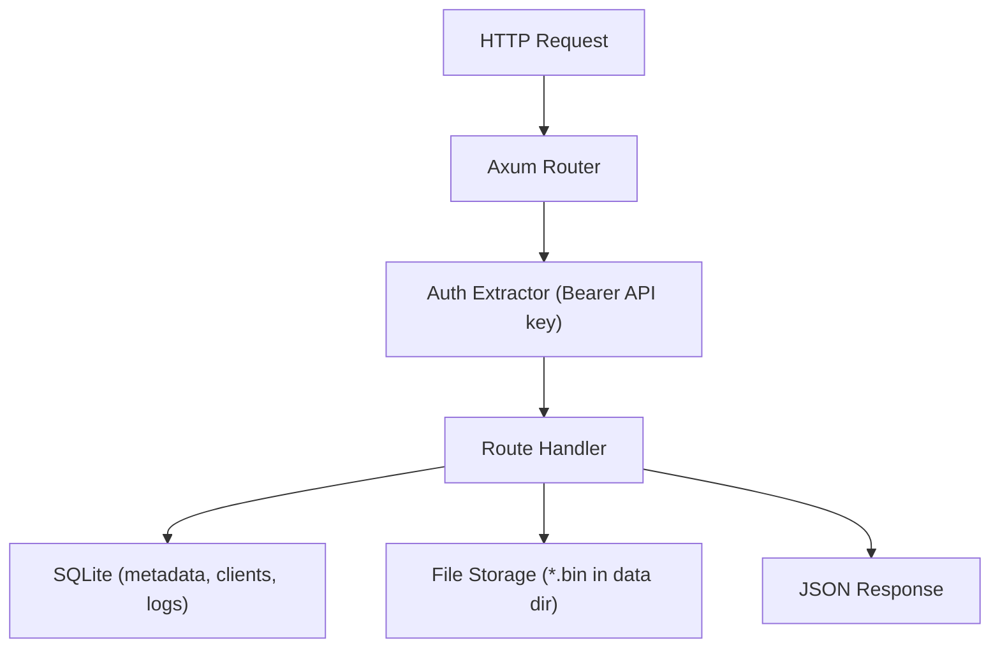
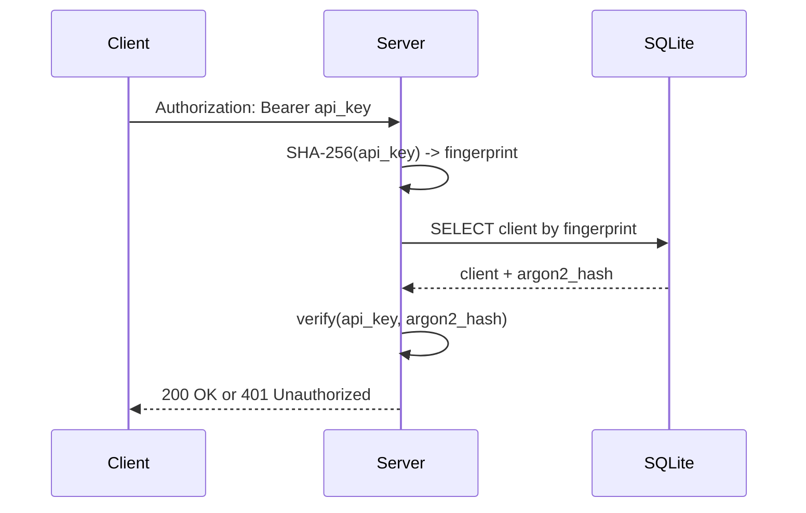

# Crate Server - Technical Documentation

This crate implements the RustSync HTTP server for Step 2 (without WebSocket), including:
- REST API with Axum
- SQLite persistence with SQLx migrations
- API key authentication with hashed storage
- File storage and metadata lifecycle
- Action logging

---

## Architecture Overview

The server is composed of focused modules:

- `lib.rs`: Router construction, tracing setup, and `serve()` entrypoint
- `config.rs`: Runtime configuration (host, port, database URL, data directory)
- `state.rs`: Shared application state (`SqlitePool`, data directory, log limits) and migration startup
- `auth.rs`: `AuthenticatedClient` extractor reading `Authorization: Bearer <api_key>`
- `security.rs`: API key generation, fingerprinting, hashing, and verification
- `handlers.rs`: REST endpoint implementations
- `storage.rs`: Path validation and file content storage path logic
- `migrations/001_init.sql`: SQLite schema



---

## API Endpoints

### Public endpoint
- `GET /health`

### Registration endpoint
- `POST /api/clients/register`
  - Input: `name`, `public_key` (base64)
  - Output: `client_id`, `registered_at`, and plaintext `api_key` (returned only once)

### Authenticated endpoints
- `GET /api/files`: list all file metadata
- `POST /api/files`: create or update file content + metadata
- `GET /api/files/:id/download`: download file bytes
- `DELETE /api/files/:id`: delete file metadata and storage content
- `GET /api/logs?limit=n`: list logs for the authenticated client

---

## Authentication and API Key Security

API keys are never stored in plaintext:

1. Server generates a random API key (`rsk_...`) at registration.
2. Server stores:
   - `api_key_fingerprint`: SHA-256 hex of the plaintext key (indexed lookup)
   - `api_key_hash`: Argon2 password hash (verification)
3. On authenticated requests:
   - Extract bearer token
   - Compute fingerprint and fetch candidate client row
   - Verify token against Argon2 hash



---

## Database Schema

Migration: `migrations/001_init.sql`

- `clients`
  - `id`, `name`, `public_key`, `api_key_fingerprint`, `api_key_hash`, `registered_at`
- `files`
  - `id`, `owner_client_id`, `path` (unique), `size`, `checksum`, `version`, `last_modified`
- `file_logs`
  - `id`, `file_id` (nullable), `client_id`, `action`, `timestamp`, `metadata`
  - `file_id` uses `ON DELETE SET NULL` to preserve logs after file deletion

---

## File Lifecycle

Upload flow (`POST /api/files`):
- Validate path is relative and traversal-safe
- Decode `content_base64`
- Compute checksum (SHA-256)
- Upsert metadata in `files` table:
  - New file: create `id`, set `version = 1`
  - Existing path: increment version
- Write bytes to `{data_dir}/{file_id}.bin`
- Insert upload log entry in `file_logs`

Delete flow (`DELETE /api/files/:id`):
- Delete row from `files`
- Insert delete log with `deleted_file_id` in metadata
- Remove content file from disk (best effort if already missing)

---

## Error Model

All server errors are in English and serialized as JSON:

```json
{
  "error": "bad_request",
  "message": "File path must be relative"
}
```

Main categories:
- `bad_request`
- `unauthorized`
- `not_found`
- `internal_error`

---

## Test Coverage

The server crate includes integration-style tests that cover:
- registration with hashed key persistence
- authorized upload/list/download/delete lifecycle
- authorization enforcement
- invalid path rejection
- logs retrieval

Run:

```bash
cargo test -p server
```
